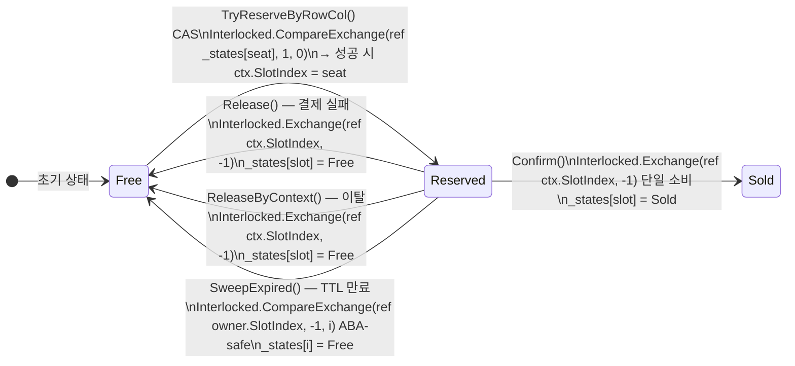
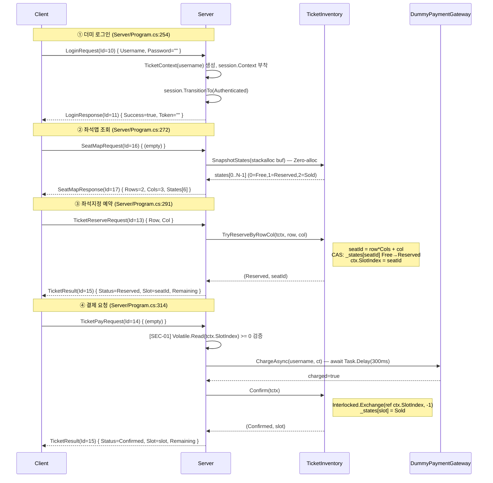
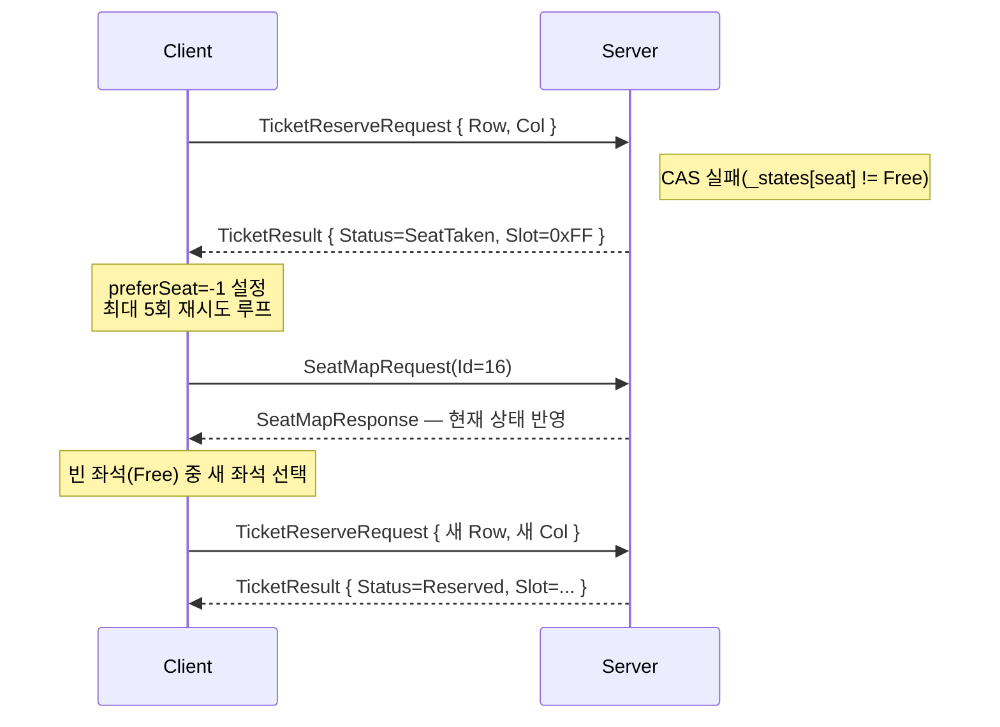
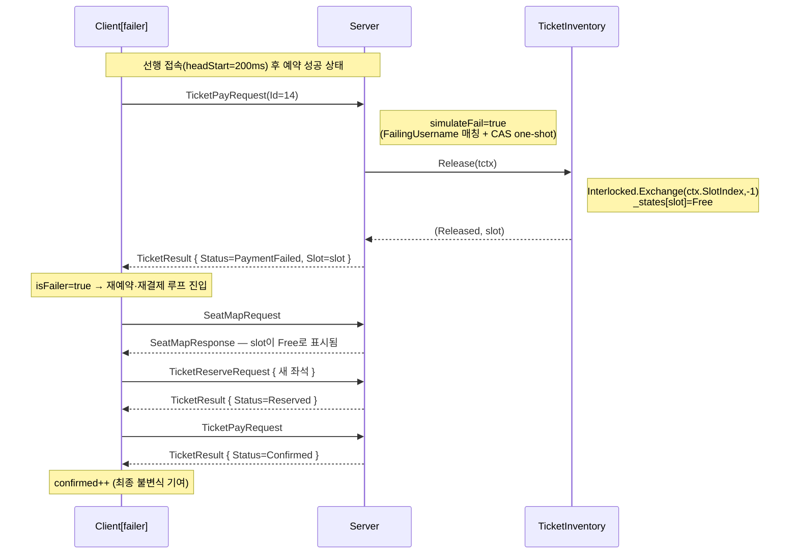

# 티켓팅 시스템 흐름 문서

> **마지막 업데이트:** 2026-06-21  
> **대상 버전:** 좌석지정 예약(2D 그리드·SeatMapRequest/Response·SeatTaken 재선택) 포함

---

## 1. 개요

선착순 **좌석지정** 예약 시스템. 기본 설정 2×3 그리드(6석)에서 **reserve-then-pay** 두 단계 모델로 동작한다.

- **Reserve 단계**: `Interlocked.CompareExchange`(CAS) 한 번으로 좌석 점유 — lock-free
- **Pay 단계**: 결제 게이트웨이 호출(비동기) 후 슬롯 확정(`Sold`)
- **보상**: 결제 실패·이탈·TTL 만료 시 슬롯을 `Free`로 원자 반납

> 최종 불변식: `Confirmed == min(ClientCount, TotalSeats)` (7클라·6석 → 6 확정, 1 SoldOut)

---

## 2. 구성 요소 맵

### 2-1. 도메인 코드

| 파일 | 클래스 | 역할 |
|---|---|---|
| `Ticketing/TicketInventory.cs` | `TicketInventory` | 상태 배열·CAS 상태머신. `TryReserveByRowCol`, `Confirm`, `Release`, `ReleaseByContext`, `SweepExpired`, `SnapshotStates` |
| `Ticketing/TicketContext.cs` | `TicketContext` | 세션에 부착되는 컨텍스트. `Username`(불변), `SlotIndex`(선형화 앵커, -1=예약 없음) |
| `Ticketing/DummyPaymentGateway.cs` | `DummyPaymentGateway` | 결제 시뮬레이터. `ChargeAsync(username, ct)` → `Task.Delay(300ms)` → 무작위 성공/실패 |

### 2-2. 패킷 프로토콜

| 패킷 | ID | 방향 | 바디 크기 | 필드 |
|---|---|---|---|---|
| `LoginRequestPacket` | **10** | C → S | 가변 | `Username`, `Password` |
| `LoginResponsePacket` | **11** | S → C | 가변 | `Success`, `Token` |
| `TicketReserveRequestPacket` | **13** | C → S | 2 B | `Row(1B)`, `Col(1B)` |
| `TicketPayRequestPacket` | **14** | C → S | 0 B | (없음) — 서버가 세션 컨텍스트 참조 |
| `TicketResultPacket` | **15** | S → C | 3 B | `Status(1B)`, `Slot(1B)`, `Remaining(1B)` |
| `SeatMapRequestPacket` | **16** | C → S | 0 B | (없음) |
| `SeatMapResponsePacket` | **17** | S → C | 2+N B | `Rows(1B)`, `Cols(1B)`, `States[Rows×Cols]` |

**`TicketStatus` 열거형**

| 값 | 정수 | 의미 |
|---|---|---|
| `Reserved` | 0 | 예약 성공 |
| `SoldOut` | 1 | 매진 |
| `AlreadyReserved` | 2 | 이미 예약 중 |
| `NotReserved` | 3 | 예약 없이 결제·결제 중복 |
| `Confirmed` | 4 | 결제 확정 |
| `PaymentFailed` | 5 | 결제 실패 |
| `Released` | 6 | 슬롯 반납됨 |
| `SeatTaken` | 7 | 지정 좌석 이미 점유됨 |

**`SeatMapResponsePacket.States[]` 바이트 의미**: `0=Free`, `1=Reserved`, `2=Sold`

**`TicketResultPacket.Slot` 특수값**: `0xFF(255)` = `NoSlot` (좌석 없음)

### 2-3. 호스트 및 설정

| 항목 | 위치 |
|---|---|
| 서버 핸들러 | `Server/Program.cs` — `listener.OnReceived` |
| 클라이언트 데모 | `Client/Program.cs` — `RunTicketingDemoAsync` |
| 서버 설정 | `AppConfig/ServerConfig.cs` — `TicketConfig` (Rows=2, Cols=3, ReservationTtlSeconds=30, PaymentDelayMs=300, FailingUsername) |
| 클라이언트 설정 | `AppConfig/ClientConfig.cs` — `TicketingClientConfig` (ClientCount=7, FailingClientIndex=0, FailerHeadStartMs=200) |

---

## 3. 좌석 상태 전이



> **단일 소비 원칙**: `Confirm` / `Release` / `ReleaseByContext` / `SweepExpired` 모두 `ctx.SlotIndex`를 두고 경합하며, 정확히 **하나만** `Interlocked` 연산에 승리한다. 두 번째 호출은 `-1`을 돌려받아 no-op.

---

## 4. 정상 경로 — 패킷 시퀀스



---

## 5. 예외 분기 흐름

### 5-1. SeatTaken — 좌석 경합 재시도

좌석 지정 시 다른 클라이언트가 먼저 CAS에 성공한 경우.



**클라이언트 로직** (`Client/Program.cs:344`): `preferSeat=-1`로 재설정 후 `RequestSeatMapAndPickFreeAsync()`를 다시 호출. 최대 5회(`maxReserveTries`) 이후에는 포기.

---

### 5-2. 결제 실패 + 복구 (Failer 경로)

서버 설정 `FailingUsername`과 일치하는 첫 번째 결제 요청을 결정론적으로 실패시킨다 (`Server/Program.cs:334`, `[SEC-NEW-01]`).



---

### 5-3. SEC-01 — 예약 없이 결제 차단

`Server/Program.cs:320` — 결제 핸들러 최상단의 선제 검증.

```
TicketPayRequest 수신
  └─ Volatile.Read(tctx.SlotIndex) < 0 ?
       ├─ YES: TicketResult { NotReserved } 반환 → 종료
       └─ NO: 결제 절차 계속
```

**효과**: 예약 없는 결제, 이중 결제(슬롯이 이미 Confirm/Release로 소비됨) 모두 차단.

---

### 5-4. TTL 만료 — 자동 반납

`Server/Program.cs:465` — 1초 주기 `Task.Run` 스위퍼.

```
매 1000ms:
  SweepExpired() 호출
    for each slot i:
      _states[i] == Reserved ?
        (now - _reservedAtTicks[i]) >= ttlTicks ?  (기본 30초)
          owner = _owners[i]
          CAS: owner.SlotIndex == i → -1  (ABA-safe)
            ├─ CAS 성공: _owners[i]=null, _states[i]=Free  → released++
            └─ CAS 실패: 이미 Confirm/Release가 소비 → no-op
  released > 0 → [TTL] 로그 출력
```

**ABA 안전**: 스위퍼가 소유자 참조를 읽은 뒤 해당 클라이언트가 이미 결제를 완료하고 새 슬롯을 예약했더라도, `owner.SlotIndex != i` 이므로 CAS가 실패한다.

---

### 5-5. 이탈 시 자동 반납

`Server/Program.cs:156` — `listener.OnClientDisconnected`.

```
세션 연결 해제
  └─ session.GetContext<TicketContext>() → tctx
       ├─ tctx is null: (로그인 전 이탈) no-op
       └─ tctx 있음:
            ticketInventory.ReleaseByContext(tctx)
              └─ Interlocked.Exchange(ref ctx.SlotIndex, -1)
                   ├─ slot < 0: (이미 확정·반납됨) no-op
                   └─ slot >= 0: _states[slot]=Free
```

---

### 5-6. TTL 레이스 `[LF-가설1]` — 결제 성공 후 슬롯 상실

결제 게이트웨이 호출(`await ChargeAsync`) 중에 TTL 스위퍼가 슬롯을 회수하는 극단적 경합.

```
Server/Program.cs:362
  charged=true
  Confirm(tctx) 호출
    └─ Interlocked.Exchange(ref ctx.SlotIndex, -1) 반환값 < 0
         (스위퍼가 이미 SlotIndex를 -1로 소비)
  → status == NotReserved
  → TicketResult { PaymentFailed } 응답
  → [TICKET-WARN] 로그 출력 (실 PG 연동 시 RefundAsync 필요)
```

---

## 6. 동시성·설계 원칙

| 항목 | 내용 |
|---|---|
| **상태 배열** | `int[] _states`: `Interlocked.CompareExchange`/`Exchange` CAS 대상 (32bit 원자 보장) |
| **소유자 배열** | `TicketContext?[] _owners`: `Volatile.Read/Write`로 가시성만 보장 (CAS 대상 아님) |
| **예약 시각 배열** | `long[] _reservedAtTicks`: `Interlocked.Read`로 torn-read 방지 |
| **선형화 앵커** | `ctx.SlotIndex`: `-1`=예약 없음, `0..N-1`=보유 슬롯. 모든 소비 경로가 `Interlocked.Exchange(ref ctx.SlotIndex, -1)`로 단 한 번만 소비 |
| **직렬 세션 디스패치** | `SocketPipelineSession`이 이전 `await`가 끝난 후 다음 패킷을 읽으므로 같은 세션의 두 패킷이 동시에 실행되지 않음 → `AlreadyReserved` 가드의 check-then-act가 안전 |
| **Slot/Remaining 크기 제한** | 두 필드 모두 `byte` → `TicketInventory` 생성자에서 `TotalTickets ≤ 255` 강제 |
| **결제 실패 시뮬레이션** | 서버 config `FailingUsername` + `Interlocked.CompareExchange(ref ticketFailerUsed, 1, 0)` one-shot → 와이어 필드 제거(`[SEC-NEW-01]`) |

---

## 7. 전체 흐름 요약 (7클라·6석 데모)

```
Client 설정: ClientCount=7, FailingClientIndex=0, FailerHeadStartMs=200ms
서버 설정:  Rows=2, Cols=3(6석), FailingUsername="user0", ReservationTtlSeconds=30

1. Client[0](failer) 접속 → 200ms 선행
   ① 로그인(Id=10)  ② 좌석맵 조회(Id=16)  ③ seatId=0 예약(Id=13) → Reserved
   ④ 결제(Id=14) → PaymentFailed (FailingUsername one-shot)
      _states[0] = Free (Release)
   ⑤ 재예약 → 다른 빈 좌석 Reserved → 재결제 → Confirmed

2. Client[1..6] 동시 접속 (headStart 200ms 경과 후)
   각각: 로그인 → 좌석맵 → 선호 좌석 지정 예약
   경합: 같은 좌석을 두 클라이언트가 동시 CAS → 하나는 SeatTaken
   SeatTaken 클라이언트: 좌석맵 재조회 → 다른 빈 좌석 재예약
   결제 → Confirmed (6석 채워지면 이후 클라는 SoldOut)

최종: Confirmed=6, SoldOut=1
      불변식 성립: 6 == min(7, 6)  ✓
```

---

## 8. 참고 문서

| 문서 | 내용 |
|---|---|
| `plan/ticketing_0618.md` | 선착순 티켓팅 최초 설계 (lock-free InventTicket·더미 로그인·reserve-then-pay·TTL 스위퍼) |
| `plan/ticketing_review_0618.md` | 1차 7차원 코드 리뷰 (SEC-01 결제전검증누락·GAP-01 SweepExpired 미테스트 등 15건) |
| `plan/ticketing_seat_designation_0619.md` | 좌석지정 예약 추가 설계 (SeatMapRequest/Response·TryReserveByRowCol·SnapshotStates) |
| `plan/ticketing_seat_designation_review_0620.md` | 2차 7차원 코드 리뷰 (ARCH-02 별칭버그·SEC-NEW-01 SimulateFailure노출·STYLE-03 2D테스트누락 등) |
